# FLC — Foreign Language Companion

<p align="center">
  
</p>

Chrome Extension + Flutter mobile + Laravel API để học tiếng Anh: tra từ Anh–Anh, lưu từ vựng, luyện nghe, quiz và nhắc ôn tập. **Một tài khoản** — dữ liệu đồng bộ giữa extension và app.

---

## Flow học tiếng Anh

FLC xoay quanh vòng lặp **gặp từ → hiểu nghĩa → lưu lại → nghe → ôn bằng quiz**. Có thể **Copy prompt** để nhờ AI ngoài app điền meanings JSON. Extension tập trung **tra từ nhanh** trên trang.

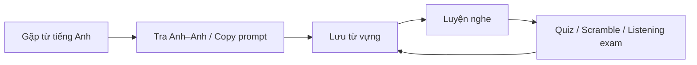

| Bước | Chrome extension | Web / mobile app |
|------|------------------|------------------|
| **Tra từ** | Bôi đen → **Tra từ với FLC**, hoặc popup tab Tra từ (lemma resolve) | Tab **Lookup** — tra từ + Copy prompt / JSON meanings |
| **Lưu từ** | Tab **Từ của tôi** | **Từ vựng** (đồng bộ) |
| **Nghe** | Thêm link YouTube/audio; **listening quiz** | Tab **Nghe** — YouTube/MP3, listening quiz / exam |
| **Quiz** | Tab **Quiz**, notification Chrome | **Quiz** + **Scramble** |
| **Tiến độ** | Options / sync | **Cá nhân** — thống kê, lịch sử |

> Tra **từ điển Anh–Anh**, không dịch Việt. Cần **≥ 4 từ đã lưu** để làm vocabulary quiz (MCQ).

### Nên dùng extension hay app?

| Tình huống | Gợi ý |
|------------|--------|
| Đọc web, docs, forum trên Chrome | **Extension** (tra nhanh, lemma resolve) |
| Học trên điện thoại, nhận push nhắc quiz | **Mobile app** (WebView → web app) |
| Tự thêm link YouTube nghe lại + làm listening quiz | **Extension** hoặc **Mobile** |
| Bài nghe + listening quiz / exam | **Mobile app** hoặc web **Nghe** |

---

## Hình ảnh — Chrome Extension

### Tra từ trên trang web

Bôi đen từ → chuột phải **Tra từ với FLC**.

<p align="center">
  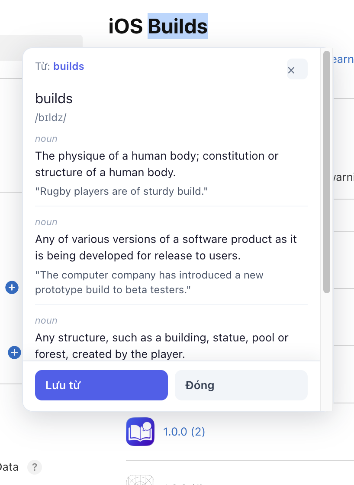
</p>

### Popup extension

<p align="center">
  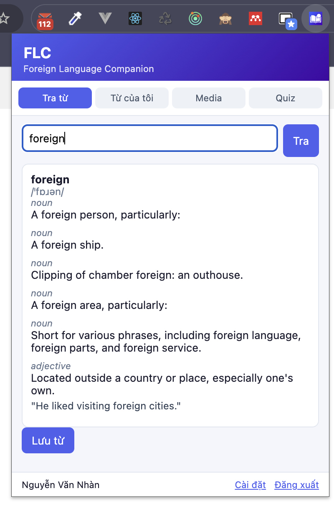
  &nbsp;&nbsp;
  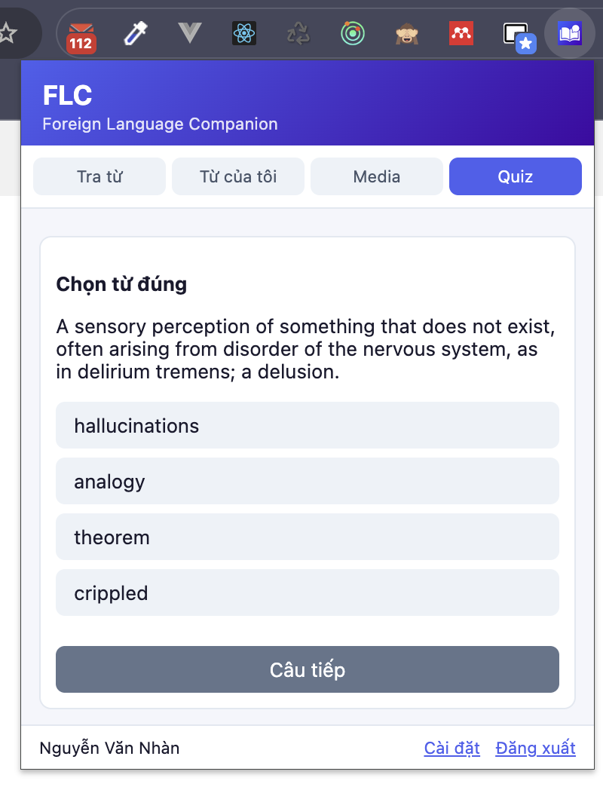
</p>

---

## Hình ảnh — Mobile App

<p align="center">
  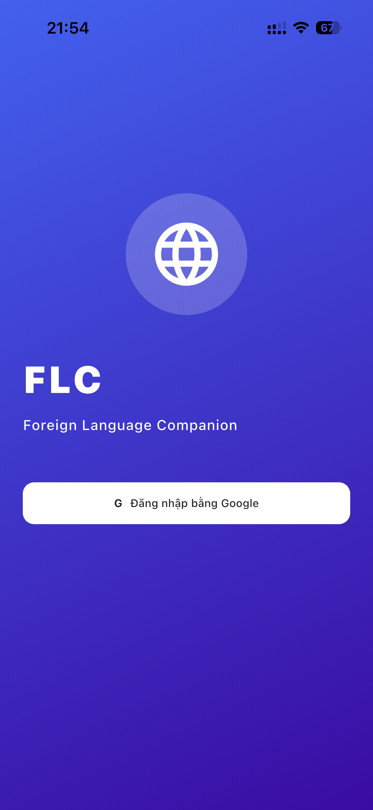
  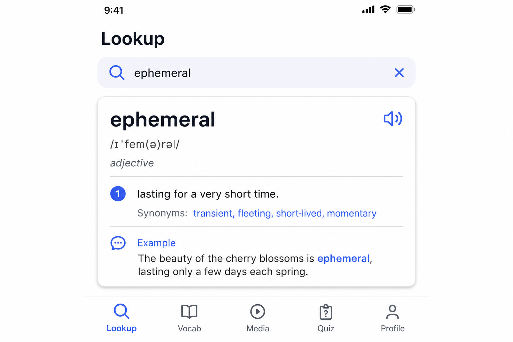
  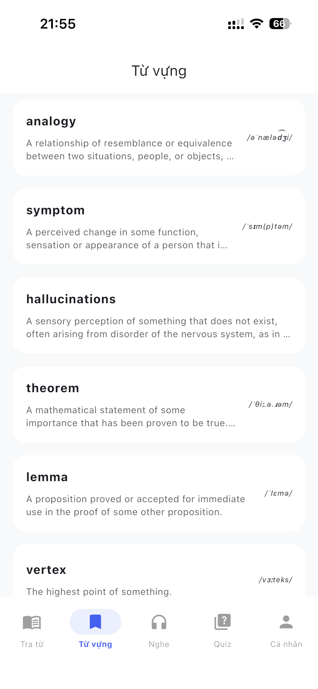
</p>

<p align="center">
  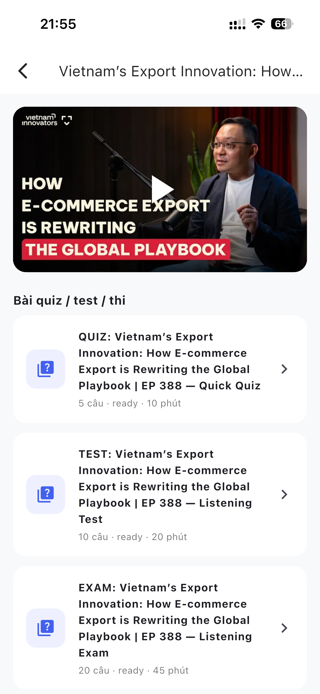
  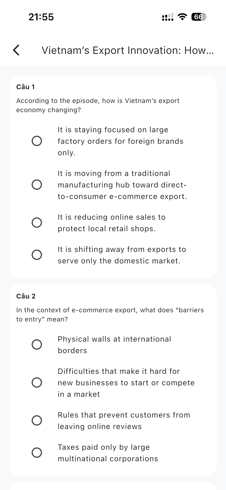
  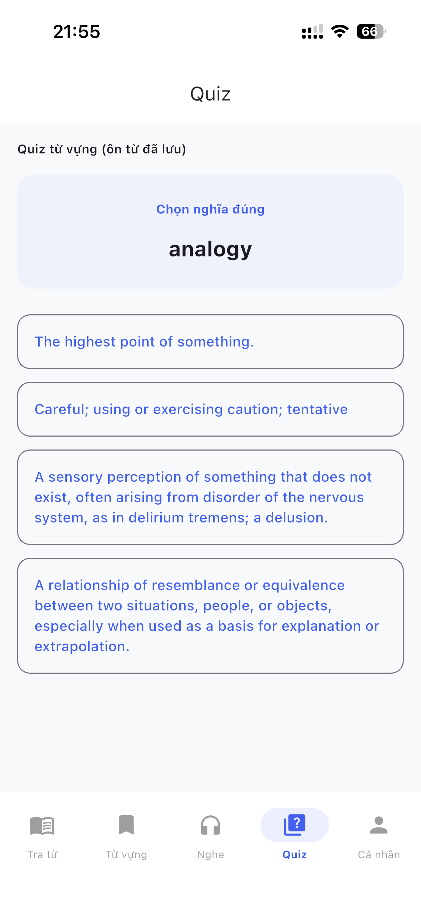
  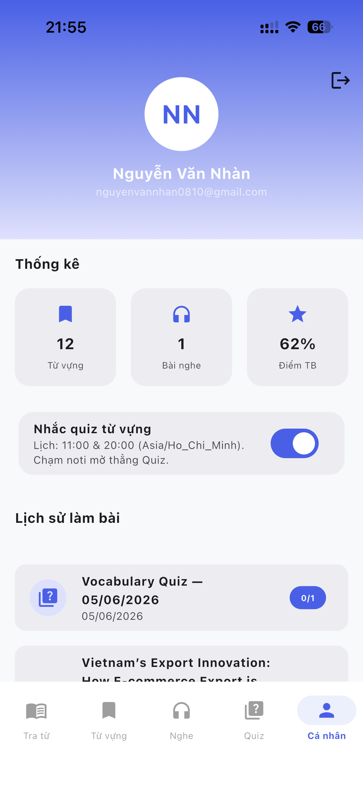
</p>

---

## Tech stack

| Thành phần | Công nghệ |
|------------|------------|
| **Backend** | Laravel · PostgreSQL · Sanctum · [DDD/CQRS/ES](docs/ARCHITECTURE_DDD_CQRS.md) |
| **Extension** | Chrome MV3 · TypeScript · Vite |
| **Mobile** | Flutter · Riverpod · Firebase Cloud Messaging |
| **Dictionary** | My Dictionary (ES) + [Free Dictionary API](https://dictionaryapi.dev/) |

---

## Cấu trúc repo

| Thư mục | Mô tả |
|---------|--------|
| `docs/` | Tài liệu + hình minh họa ([ARCHITECTURE_DDD_CQRS](docs/ARCHITECTURE_DDD_CQRS.md), [DICTIONARY_DB](docs/DICTIONARY_DB.md)) |
| `backend/` | Laravel API + Admin (`app/` delivery, `src/Flc/` domain) |
| `extension/` | Chrome Extension MV3 |
| `mobile/` | Flutter app (iOS / Android) |

## Yêu cầu dev

- Docker Desktop (Laravel Sail)
- Node.js 18+ (extension)
- Flutter 3.16+ (mobile — [mobile/README.md](mobile/README.md))

---

## Backend (Laravel Sail)

```bash
cd backend
cp .env.example .env   # nếu chưa có .env
./vendor/bin/sail up -d
./vendor/bin/sail artisan migrate
```

API mặc định: **http://localhost:8080/api**

- Web user (mặc định)

**http://localhost:8080** — Lookup, từ vựng, nghe, quiz, scramble, hồ sơ (đăng nhập Google riêng).

- Trang Admin

**http://localhost:8080/admin** — allowlist, cài đặt, users, từ vựng, media.

-  Đăng nhập Google
- Push nhắc quiz (mobile): FCM 11:00 & 20:00 giờ VN

---

## Chrome Extension

```bash
cd extension
npm install
npm run build
```

Load unpacked: `chrome://extensions` → **Load unpacked** → `extension/dist`

1. **Đăng nhập Google** (email trong allowlist)
2. Tab **Tra từ** — hoặc bôi đen → chuột phải **Tra từ với FLC**
3. Tab **Media** — thêm link YouTube/audio
4. **Cài đặt** — API URL, quiz/ngày, nhắc nghe

**Notification:** quiz (≥ 4 từ), nhắc media đến hạn nghe lại.

---

## Flutter Mobile

```bash
cd mobile
cp .env.example .env
fvm flutter pub get
fvm flutter run
```

Chi tiết OAuth, YouTube/MP3, build release: [mobile/README.md](mobile/README.md)

---

## Phát triển

```bash
cd backend && ./vendor/bin/sail logs -f
cd extension && npm run dev
```
